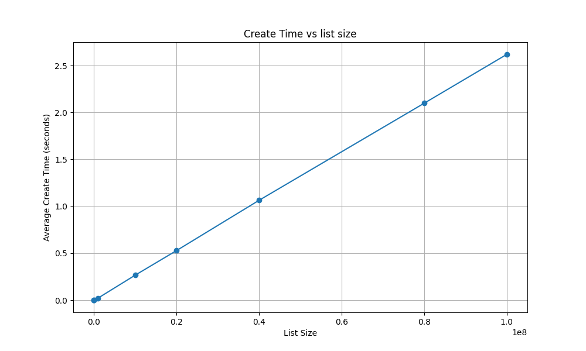
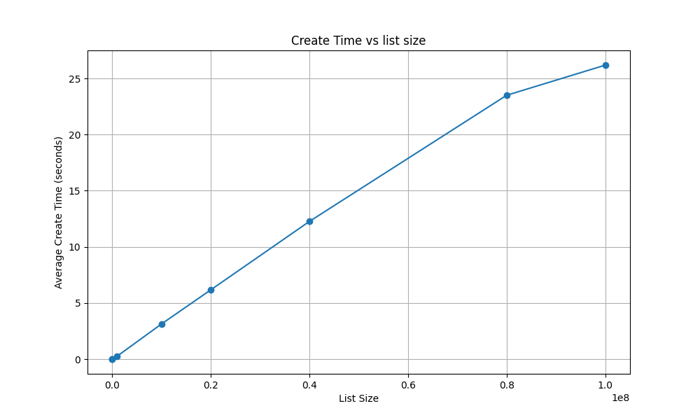

# list-vs-array-vs-numpy

## A. Notes

- ns: nanosecond
- us: microsecond
- ms: millisecond
- s: second

- el: element
- pos: position

Experiments were made on Intel i7-9750H cpu @2.6GHz.
Individual results will vary depending on CPU, but the performance ratio between different data structures should be independent of your hardware.

## B. Conclusions

To be found.

## C. Some Helpful Resources

These can help in many way to bring theoretical insights about these practical findings, give technical help and ideas for new performance tests, and go beyond what is discussed in this repository

- https://realpython.com/python-list/
- https://www.geeksforgeeks.org/python/python-lists-vs-numpy-arrays/

## D. Lists

### D.1. Creation

> ***D.1.a. Creating a list of 0s***

Here, we test list creation in python and benchmark the time it takes. We average over 100 iterations.

| created list size | timing |
| --------- | ------- |
| 0 | 170 ns |
| 1k | 1.34 us |
| 1M | 3.17 ms |
| 10M | 29.5 ms |
| 20M | 58.6 ms |
| 40M | 118.6 ms |
| 80M | 245.4 ms |
| 100M | 310.8 ms |

The associated graph is linear as shown below:

So this does go hand in hand with the fact that creating a list in python has a time complexity of O(n)

> ***D.1.b. Creating a list from a range of integers***

| created list size | timing |
| --------- | ------- |
| 0 | 750 ns |
| 1k | 18.3 us |
| 1M | 21.4 ms |
| 10M | 266.8 ms |
| 20M | 527.6 ms |
| 40M | 1.06 s |
| 80M | 2.10 s |
| 100M | 2.6 s |

This shows that creating lists from range() is around 10 times slower than creating a list of zeros. As such, if they serve the same purpose, like initializing a list to fill later, creating a list of zero is far more time efficient. 

Note that the time complexity is still O(n). But the time to operate on each element is now around 10 times higher. 

> ***D.1.c. Creating a list using list comprehensions***

| created list size | timing |
| --------- | ------- |
| 0 | 620 ns |
| 1k | 63.3 us |
| 1M | 50.3 ms |
| 10M | 564.3 ms |
| 20M | 1.11 s |
| 40M | 2.33 s |
| 80M | 4.59 s |
| 100M | 5.68 s |

The numbers seem to suggest that creating a list using list comprehensions is 2 times slower than through an iterable like range() and 20 times slower than creating a list of zeros.

> ***D.1.d creating a list of random numbers***

| created list size | timing |
| --------- | ------- |
| 0 | 230 ns |
| 1k | 318.2 us |
| 1M | 255 ms |
| 10M | 3.13 s |
| 20M | 6.17 s |
| 40M | 12.27 s |
| 80M | 23.5 s |
| 100M | 26.2 s |

We can thus see when when trying to create a list of random floats, this is:
- 5 times slower than creating a list with comprehensions
- 10 times slower than creating a list from an iterable
- 100 times slower than creating a list of zeros

### D.2. Insertion

The file associated with this part is code/lists/insertion.py

In the graph below, timing was averaged over more than 100 iterations at minimum

| method | initial list size | insertion position| timing  |
| ------ | ------ | -------- | ----------------- |
| .append() 1 el | 3 | _ | 13 ns|
| .append() 1 el | 1000 | _ | 11 ns |
| .append() 1 el | 100000 | _ | 12 ns |
| .insert() 1 el | 10 | 2 | 15 ns| 
| .insert() 1 el | 10 | 5 | 13 ns | 
| .insert() 1 el | 10 | 8 | 13 ns |
| .insert() 1 el | 1000 | 50 | 402 ns| 
| .insert() 1 el | 1000 | 450 | 311 ns | 
| .insert() 1 el | 1000 | 850 | 198 ns |
| .insert() 1 el | 100000 | 50 | 34000 ns| 
| .insert() 1 el | 100000 | 50000 | 16000 ns | 
| .insert() 1 el | 100000 | 9950 | 282 ns |
| .insert() 1 el | 100,000,000 | 50 | **78 ms** | 
| .insert() 1 el | 100,000,000 | 50,000,000 | 39 ms | 
| .insert() 1 el | 100,000,000 | 99,999,500 | 380 ns |

- Conclusions: 
  - .append()
    - append is very fast at 11ns per element
    - execution time is independent of the list's size
    - this is expected as it's time complexity is Amortized O(1)
  - .insert()
    - fast for small lists, gets increasingly slower for bigger ones
    - depends on which position you insert at.
    - better performance when inserting near the end
    - this is expected as it's time complexity is O(n) at worst, when inserting at beginning of the list

The following graph shows how inserting at different positions requires different time on average:

The one below shows how inserting at position 0 is affected by the size of the list in a clearly linear way:

Note that for both graphs above, at each position, the time value has been average over more than 100 iterations at least. The time given is thus the average time for a single insertion