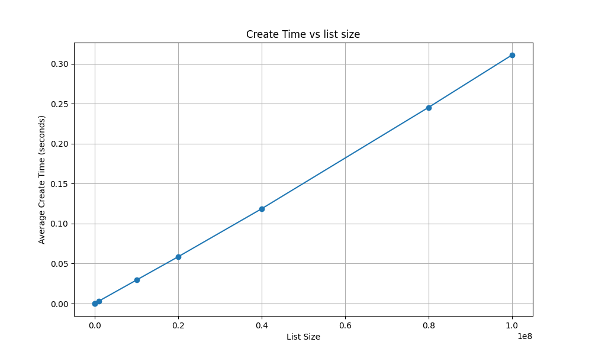
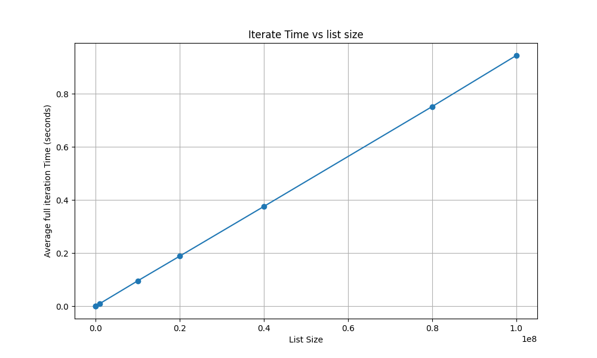
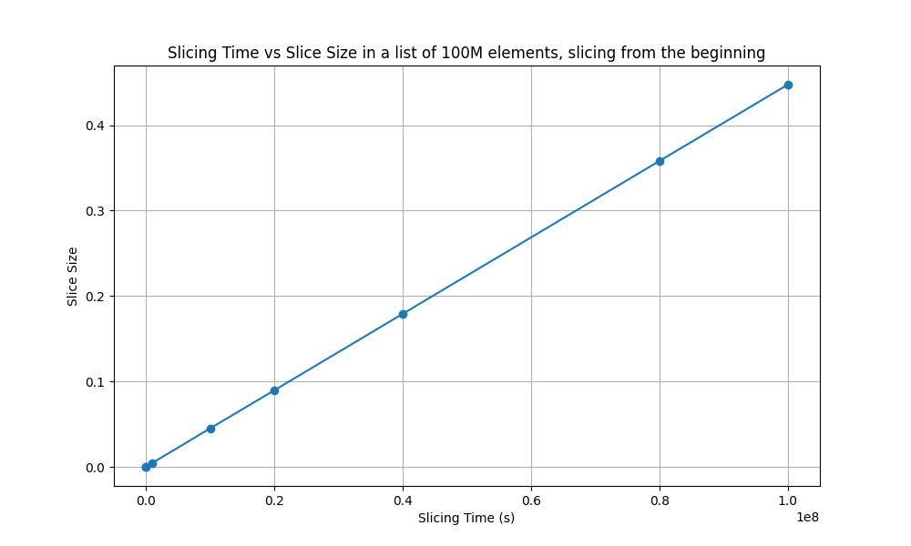

# Overview

This repository aims to benchmark the performance of:
- lists
- arrays (from python's array module)
- numpy arrays
- numpy arrays with numba

The repository is still under construction.

# Table of Content

- [Overview](#overview)
- [Table of Content](#table-of-content)
- [Content](#content)
  - [A. Notes](#a-notes)
  - [B. Conclusions](#b-conclusions)
  - [C. Some Helpful Resources](#c-some-helpful-resources)
  - [D. Lists](#d-lists)
    - [D.1. Creation](#d1-creation)
    - [D.2. Insertion](#d2-insertion)
    - [D.3. Iteration](#d3-iteration)
    - [D.4. Access](#d4-access)
    - [D.5. Deletion](#d5-deletion)
    - [D.6. Slicing](#d6-slicing)
    - [D.7. Searching](#d7-searching)
    - [D.8. Sorting](#d8-sorting)
  - [E. Arrays](#e-arrays)
    - [E.1. Creation](#e1-creation)
    - [E.2. Insertion](#e2-insertion)
    - [E.3. Iteration](#e3-iteration)
    - [E.4. Access](#e4-access)
    - [E.5. Deletion](#e5-deletion)
    - [E.6. Slicing](#e6-slicing)
    - [E.7. Searching](#e7-searching)
    - [E.8. Sorting](#e8-sorting)
  - [F. Numpy Arrays](#f-numpy-arrays)
    - [F.1. Creation](#f1-creation)
    - [F.2. Insertion](#f2-insertion)
    - [F.3. Iteration](#f3-iteration)
    - [F.4. Access](#f4-access)
    - [F.5. Deletion](#f5-deletion)
    - [F.6. Slicing](#f6-slicing)
    - [F.7. Searching](#f7-searching)
    - [F.8. Sorting](#f8-sorting)
  - [G. Numpy Arrays with Numba](#g-numpy-arrays-with-numba)
    - [G.1. Creation](#g1-creation)
    - [G.2. Insertion](#g2-insertion)
    - [G.3. Iteration](#g3-iteration)
    - [G.4. Access](#g4-access)
    - [G.5. Deletion](#g5-deletion)
    - [G.6. Slicing](#g6-slicing)
    - [G.7. Searching](#g7-searching)
    - [G.8. Sorting](#g8-sorting)

# Content

## A. Notes

We use the following annotations throughout the readme:
- ns: nanosecond
- us: microsecond
- ms: millisecond
- s: second

- el: element
- pos: position

- k: thousand
- M: million

Experiments were made on Intel i7-9750H cpu @2.6GHz.
Individual results will vary depending on CPU, but the performance ratio between different data structures should be independent of your hardware.

## B. Conclusions

In Progress...

The most intuitive way (we can think of) to compare performancce between lists, arrays, numpy arrays and numba would be to select some tasks, and record the performance of each on these tasks, relatively.

The time for each task below has been averaged over 100 iterations

Selected Tasks:
- A: creating an array-like structure of 100M random floats
- B: iterating over an array-like structure of 100M floats, summing all elements
- C: accessing an element (read or write, at any position and for any size)
- D: sorting an array-like structure of 10M floats

| Task | Lists | Arrays | np Arrays | np Arrays + numba |
| ---- | ----- | ------ | --------- | ----------------- |
| A    | 26.2 s | 26.1 s | 1.03 s    | 0.70 s |
| B    | 3.62 s | 3.87 s | 9.45 s | 0.11 s |
| C    | 120 ns | 150 ns | 190 ns | 300 ns |
| D    | 3.71 s | - | 0.18 s | 1.2 s |

## C. Some Helpful Resources

These can help in many way to bring theoretical insights about these practical findings, give technical help and ideas for new performance tests, and go beyond what is discussed in this repository

- [python lists: real python](https://realpython.com/python-list/)
- [list vs numpy array](https://www.geeksforgeeks.org/python/python-lists-vs-numpy-arrays/)
- [numba's supported numpy features](https://numba.readthedocs.io/en/stable/reference/numpysupported.html)

Specific:
- [sorted time complexity](https://coderivers.org/blog/python-sorted-time-complexity/)
- [numba sorting is slower](https://github.com/numba/numba/issues/9611)

## D. Lists

### D.1. Creation

> ***D.1.a. Creating a list of 0s***

Here, we test list creation in python and benchmark the time it takes. We average over 100 iterations.

| created list size | timing |
| --------- | ------- |
| 0 | 170 ns |
| 1k | 1.34 us |
| 1M | 3.17 ms |
| 10M | 29.5 ms |
| 20M | 58.6 ms |
| 40M | 118.6 ms |
| 80M | 245.4 ms |
| 100M | 310.8 ms |

The associated graph is linear as shown below:

So this does go hand in hand with the fact that creating a list in python has a time complexity of O(n)

> ***D.1.b. Creating a list from a range of integers***

| created list size | timing |
| --------- | ------- |
| 0 | 750 ns |
| 1k | 18.3 us |
| 1M | 21.4 ms |
| 10M | 266.8 ms |
| 20M | 527.6 ms |
| 40M | 1.06 s |
| 80M | 2.10 s |
| 100M | 2.6 s |

This shows that creating lists from range() is around 10 times slower than creating a list of zeros. As such, if they serve the same purpose, like initializing a list to fill later, creating a list of zero is far more time efficient. 

Note that the time complexity is still O(n). But the time to operate on each element is now around 10 times higher. 

> ***D.1.c. Creating a list using list comprehensions***

| created list size | timing |
| --------- | ------- |
| 0 | 620 ns |
| 1k | 63.3 us |
| 1M | 50.3 ms |
| 10M | 564.3 ms |
| 20M | 1.11 s |
| 40M | 2.33 s |
| 80M | 4.59 s |
| 100M | 5.68 s |

The numbers seem to suggest that creating a list using list comprehensions is 2 times slower than through an iterable like range() and 20 times slower than creating a list of zeros.

> ***D.1.d creating a list of random numbers***

| created list size | timing |
| --------- | ------- |
| 0 | 230 ns |
| 1k | 318.2 us |
| 1M | 255 ms |
| 10M | 3.13 s |
| 20M | 6.17 s |
| 40M | 12.27 s |
| 80M | 23.5 s |
| 100M | 26.2 s |

We can thus see when when trying to create a list of random floats, this is:
- 5 times slower than creating a list with comprehensions
- 10 times slower than creating a list from an iterable
- 100 times slower than creating a list of zeros

### D.2. Insertion

The file associated with this part is code/lists/insertion.py

In the graph below, timing was averaged over more than 100 iterations at minimum

| method | initial list size | insertion position| timing  |
| ------ | ------ | -------- | ----------------- |
| .append() 1 el | 3 | _ | 13 ns|
| .append() 1 el | 1000 | _ | 11 ns |
| .append() 1 el | 100000 | _ | 12 ns |
| .insert() 1 el | 10 | 2 | 15 ns| 
| .insert() 1 el | 10 | 5 | 13 ns | 
| .insert() 1 el | 10 | 8 | 13 ns |
| .insert() 1 el | 1000 | 50 | 402 ns| 
| .insert() 1 el | 1000 | 450 | 311 ns | 
| .insert() 1 el | 1000 | 850 | 198 ns |
| .insert() 1 el | 100000 | 50 | 34000 ns| 
| .insert() 1 el | 100000 | 50000 | 16000 ns | 
| .insert() 1 el | 100000 | 9950 | 282 ns |
| .insert() 1 el | 100,000,000 | 50 | **78 ms** | 
| .insert() 1 el | 100,000,000 | 50,000,000 | 39 ms | 
| .insert() 1 el | 100,000,000 | 99,999,500 | 380 ns |

- Conclusions: 
  - .append()
    - append is very fast at 11ns per element
    - execution time is independent of the list's size
    - this is expected as it's time complexity is Amortized O(1)
  - .insert()
    - fast for small lists, gets increasingly slower for bigger ones
    - depends on which position you insert at.
    - better performance when inserting near the end
    - this is expected as it's time complexity is O(n) at worst, when inserting at beginning of the list

The following graph shows how inserting at different positions requires different time on average:

The one below shows how inserting at position 0 is affected by the size of the list in a clearly linear way:

Note that for both graphs above, at each position, the time value has been average over more than 100 iterations at least. The time given is thus the average time for a single insertion

### D.3. Iteration

Iteration with a for loop is clearly of time complexity O(n). That being said, we still aim to benchmark the time and draw the graph! `;)`

The table below shows how long it takes to iterate over a list of each size using our CPU, for some chosen list sizes 

| list size | timing |
| --------- | ------- |
| 0 | 120 ns |
| 1k | 7.54 us |
| 1M | 9.56 ms |
| 10M | 95.2 ms |
| 20M | 189 ms |
| 40M | 376 ms |
| 80M | 752 ms |
| 100M | 945 ms |

Note that for this test, we only use the `pass` keyword at each iteration rather than performing any other action.

### D.4. Access

Access takes constant time (O(1)). In practice:
- reading: 
  - 120 ns
  - independent of position of element read (and list size)
- writing:
  - 120 ns
  - independent of position to write at (and list size)

### D.5. Deletion

deleting elements using `del lst[pos]` from a list of 100M elements, we get the following table and graph:

| deletion position | timing |
| ----------------- | ------ |
| 0   | 75.0 ms |
| 10M | 66.6 ms |
| 20M | 60.2 ms |
| 40M | 45.2 ms |
| 60M | 29.9 ms |
| 80M | 14.9 ms |
| 100M - 1 | 0.15 ms | 

### D.6. Slicing

Slicing a list of 100M elements with different number of elements sliced (slice size), at a constant position, we get:

| Slice Size | Time |
| ----- | ----- |
| 100 | 630 ns |
| 10k | 26.6 us |
| 1M  | 4.58 ms |
| 10M | 45.0 ms |
| 20M | 89.6 ms |
| 40M | 179 ms |
| 80M | 358 ms |
| 100M | 470 ms |

Slicing a list of 100M elements with a constant slice size of 1M elements, at different positions, we get:

| Slice Beginning Position | Time |
| ------------------------ | ---- |
| 0 | 4.56 ms|
| 10M | 4.53 ms |
| 20M | 4.55 ms |
| 30M | 4.67 ms | 
| 40M | 4.74 ms |
| 50M | 4.61 ms |
| 60M | 4.56 ms |
| 70M | 4.71 ms |
| 80M | 4.73 ms |
| 90M | 4.55 ms |

This shows through experimentation that:
- slice time depends on the size of the slice
- slice time is independent of the position at which the slicing starts

 

### D.7. Searching

> ***coming soon***

### D.8. Sorting 

the sorted() method in python has a time complexity of O(n*log(n)) typically. [link](https://coderivers.org/blog/python-sorted-time-complexity/)

Trying to sort arrays of floats of different sizes, we get the following results:
- the table will only contain a few of the results for brevity
- the graph will be made using all points acquired (50 points)
- the results have been calculated over 1k iteration each

| List Size | Sort Time |
| ----- | ------ |
| 10k  |   2.89 ms |
| 30k  |   9.51 ms |
| 50k  |   14.9 ms |
| 80k  |   24.5 ms |
| 100k |   35.3 ms |

Measured over a list of 10M floats for 100 iterations, sorting took 3.71 s

## E. Arrays 

### E.1. Creation

> ***coming soon***

### E.2. Insertion

> ***coming soon***

### E.3. Iteration

> ***coming soon***

### E.4. Access

> ***coming soon***

### E.5. Deletion

> ***coming soon***

### E.6. Slicing

> ***coming soon***

### E.7. Searching

> ***coming soon***

### E.8. Sorting 

> ***coming soon***

## F. Numpy Arrays

### F.1. Creation

### F.2. Insertion

### F.3. Iteration

### F.4. Access

Accessing a numpy array takes constant time (O(1)). In practice:
- reading: 
  - 190 ns
  - independent of position of element read (and list size)
- writing:
  - 190 ns
  - independent of position to write at (and list size)

### F.5. Deletion

> ***coming soon***

### F.6. Slicing

> ***coming soon***

### F.7. Searching

> ***coming soon***

### F.8. Sorting 

Sorting an array of 10M floats in numpy takes around 180ms thanks to np.sort() 

This is around 20 times faster than sorting lists which took 3.71 s

## G. Numpy Arrays with Numba

### G.1. Creation

> ***coming soon***

### G.2. Insertion

> ***coming soon***

### G.3. Iteration

> ***coming soon***

### G.4. Access

Accessing a numpy array when paired with numba turns out to be around 50% slower.
This is probably because @njit compiles python code to machine language.
Each time the compiled code is called, it will involve a boundary crossing.
This overhead is unnecessary for such small and easy operations like accessing arrays

Time Complexity remains O(1) and we have:
- reading: 
  - 300 ns
  - independent of position of element read (and list size)
- writing:
  - 300 ns
  - independent of position to write at (and list size)

### G.5. Deletion

> ***coming soon***

### G.6. Slicing

> ***coming soon***

### G.7. Searching

> ***coming soon***

### G.8. Sorting 

It seems that for now, sorting numpy arrays with numba is slower than doing it just in numpy, this is also mentionned in the [numba docs](https://numba.readthedocs.io/en/stable/reference/numpysupported.html) as such:

Experimentally, we find that sorting an array of 10M floats with numba takes 1.2 s compared to numpy's 180 ms, making this a slow-down of 6 to 7 times.