# Overview

This repository aims to benchmark the performance of:
- lists
- arrays (from python's array module)
- numpy arrays
- numpy arrays with numba

The repository is still under construction.

# Table of Content

- [Overview](#overview)
- [Table of Content](#table-of-content)
- [Content](#content)
  - [A. Notes](#a-notes)
  - [B. Conclusions](#b-conclusions)
  - [C. Some Helpful Resources](#c-some-helpful-resources)
  - [D. Lists](#d-lists)
    - [D.1. Creation](#d1-creation)
    - [D.2. Insertion](#d2-insertion)
    - [D.3. Iteration](#d3-iteration)
    - [D.4. Access](#d4-access)
    - [D.5. Deletion](#d5-deletion)
    - [D.6. Slicing](#d6-slicing)
    - [D.7. Searching](#d7-searching)
    - [D.8. Sorting](#d8-sorting)
  - [E. Arrays](#e-arrays)
    - [E.1. Creation](#e1-creation)
    - [E.2. Insertion](#e2-insertion)
    - [E.3. Iteration](#e3-iteration)
    - [E.4. Access](#e4-access)
    - [E.5. Deletion](#e5-deletion)
    - [E.6. Slicing](#e6-slicing)
    - [E.7. Searching](#e7-searching)
    - [E.8. Sorting](#e8-sorting)
  - [F. Numpy Arrays](#f-numpy-arrays)
    - [F.1. Creation](#f1-creation)
    - [F.2. Insertion](#f2-insertion)
    - [F.3. Iteration](#f3-iteration)
    - [F.4. Access](#f4-access)
    - [F.5. Deletion](#f5-deletion)
    - [F.6. Slicing](#f6-slicing)
    - [F.7. Searching](#f7-searching)
    - [F.8. Sorting](#f8-sorting)
  - [G. Numpy Arrays with Numba](#g-numpy-arrays-with-numba)
    - [G.1. Creation](#g1-creation)
    - [G.2. Insertion](#g2-insertion)
    - [G.3. Iteration](#g3-iteration)
    - [G.4. Access](#g4-access)
    - [G.5. Deletion](#g5-deletion)
    - [G.6. Slicing](#g6-slicing)
    - [G.7. Searching](#g7-searching)
    - [G.8. Sorting](#g8-sorting)

# Content

## A. Notes

We use the following annotations throughout the readme:
- ns: nanosecond
- us: microsecond
- ms: millisecond
- s: second

- el: element
- pos: position

- k: thousand
- M: million

Experiments were made on Intel i7-9750H cpu @2.6GHz.
Individual results will vary depending on CPU, but the performance ratio between different data structures should be independent of your hardware.

## B. Conclusions

In Progress...

The most intuitive way (we can think of) to compare performancce between lists, arrays, numpy arrays and numba would be to select some tasks, and record the performance of each on these tasks, relatively.

The time for each task below has been averaged over 100 iterations. The best value (fastest cpu time) per task is in bold.

Selected Tasks:
- A: creating an array-like structure of 100M random floats
- B: iterating over an array-like structure of 100M floats, summing all elements
- C: accessing an element (read or write, at any position and for any size)
- D: sorting an array-like structure of 10M floats
- E:
  - E.1: searching for the position of occurance of a certain element in an array-like structure of 100 elements
  - E.2: searching for the position of occurance of a certain element in an array-like structure of 10k elements
  - E.3: searching for the position of occurance of a certain element in an array-like structure of 1M elements

| Task | Lists | Arrays | np Arrays | np Arrays + numba |
| ---- | ----- | ------ | --------- | ----------------- |
| A    | 26.2 s | 26.1 s | 1.03 s    | **0.70 s** |
| B    | 3.62 s | 3.87 s | 9.45 s | **0.11 s** |
| C    | **120 ns** | 150 ns | 190 ns | 300 ns |
| D    | 3.71 s | 3.95 s | **0.18 s** | 1.2 s |
| E.1  | 1.62 us | 3.88 us | 1.82 us | **0.8 us** |
| E.2  | 109 us | 561 us | 5.78 us | **3.85 us**|
| E.3  | 11.1 ms | 64.5 ms | 1.11 ms | **0.46 ms** |

Taking the slowest time as a reference (x1), we can show the speed up of each other data structure relatively. 

| Task | Lists | Arrays | np Arrays | np Arrays + numba |
| ---- | ----- | ------ | --------- | ----------------- |
| A    | x1 | x1 | x25  | **x37** |
| B    | x2.5 | x2.5 | x1 | **x86** |
| C    | **x2.5** | x2 | x1.5 | x1 |
| D    | x1 | x1 | **x22** | x3 |
| E.1  | x2 | x1 | x2 | **x5** |
| E.2  | x5 | x1 | x97 | **x146**|
| E.3  | x6 | x1 | x58 | **x140** |


## C. Some Helpful Resources

These can help in many way to bring theoretical insights about these practical findings, give technical help and ideas for new performance tests, and go beyond what is discussed in this repository

- [python lists: real python](https://realpython.com/python-list/)
- [list vs numpy array](https://www.geeksforgeeks.org/python/python-lists-vs-numpy-arrays/)
- [numba's supported numpy features](https://numba.readthedocs.io/en/stable/reference/numpysupported.html)

Specific:
- [sorted time complexity](https://coderivers.org/blog/python-sorted-time-complexity/)
- [numba sorting is slower](https://github.com/numba/numba/issues/9611)

## D. Lists

### D.1. Creation

> ***D.1.a. Creating a list of 0s***

Here, we test list creation in python and benchmark the time it takes. We average over 100 iterations.

| created list size | timing |
| --------- | ------- |
| 0 | 170 ns |
| 1k | 1.34 us |
| 1M | 3.17 ms |
| 10M | 29.5 ms |
| 20M | 58.6 ms |
| 40M | 118.6 ms |
| 80M | 245.4 ms |
| 100M | 310.8 ms |

The associated graph is linear as shown below:


So this does go hand in hand with the fact that creating a list in python has a time complexity of O(n)

> ***D.1.b. Creating a list from a range of integers***

| created list size | timing |
| --------- | ------- |
| 0 | 750 ns |
| 1k | 18.3 us |
| 1M | 21.4 ms |
| 10M | 266.8 ms |
| 20M | 527.6 ms |
| 40M | 1.06 s |
| 80M | 2.10 s |
| 100M | 2.6 s |

This shows that creating lists from range() is around 10 times slower than creating a list of zeros. As such, if they serve the same purpose, like initializing a list to fill later, creating a list of zero is far more time efficient. 

Note that the time complexity is still O(n). But the time to operate on each element is now around 10 times higher. 


> ***D.1.c. Creating a list using list comprehensions***

| created list size | timing |
| --------- | ------- |
| 0 | 620 ns |
| 1k | 63.3 us |
| 1M | 50.3 ms |
| 10M | 564.3 ms |
| 20M | 1.11 s |
| 40M | 2.33 s |
| 80M | 4.59 s |
| 100M | 5.68 s |

The numbers seem to suggest that creating a list using list comprehensions is 2 times slower than through an iterable like range() and 20 times slower than creating a list of zeros.

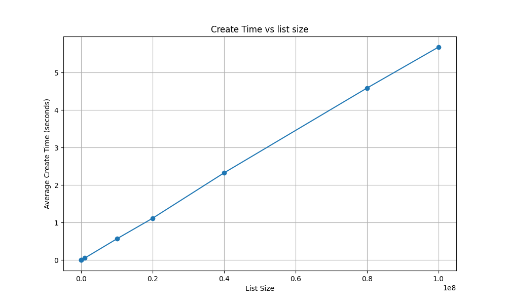

> ***D.1.d creating a list of random numbers***

| created list size | timing |
| --------- | ------- |
| 0 | 230 ns |
| 1k | 318.2 us |
| 1M | 255 ms |
| 10M | 3.13 s |
| 20M | 6.17 s |
| 40M | 12.27 s |
| 80M | 23.5 s |
| 100M | 26.2 s |


We can thus see when when trying to create a list of random floats, this is:
- 5 times slower than creating a list with comprehensions
- 10 times slower than creating a list from an iterable
- 100 times slower than creating a list of zeros

### D.2. Insertion

The file associated with this part is code/lists/insertion.py

In the graph below, timing was averaged over more than 100 iterations at minimum

| method | initial list size | insertion position| timing  |
| ------ | ------ | -------- | ----------------- |
| .append() 1 el | 3 | _ | 13 ns|
| .append() 1 el | 1000 | _ | 11 ns |
| .append() 1 el | 100000 | _ | 12 ns |
| .insert() 1 el | 10 | 2 | 15 ns| 
| .insert() 1 el | 10 | 5 | 13 ns | 
| .insert() 1 el | 10 | 8 | 13 ns |
| .insert() 1 el | 1000 | 50 | 402 ns| 
| .insert() 1 el | 1000 | 450 | 311 ns | 
| .insert() 1 el | 1000 | 850 | 198 ns |
| .insert() 1 el | 100000 | 50 | 34000 ns| 
| .insert() 1 el | 100000 | 50000 | 16000 ns | 
| .insert() 1 el | 100000 | 99500 | 282 ns |
| .insert() 1 el | 100,000,000 | 50 | **78 ms** | 
| .insert() 1 el | 100,000,000 | 50,000,000 | 39 ms | 
| .insert() 1 el | 100,000,000 | 99,999,500 | 380 ns |


- Conclusions: 
  - .append()
    - append is very fast at 11ns per element
    - execution time is independent of the list's size
    - this is expected as it's time complexity is Amortized O(1)
  - .insert()
    - fast for small lists, gets increasingly slower for bigger ones
    - depends on which position you insert at.
    - better performance when inserting near the end
    - this is expected as it's time complexity is O(n) at worst, when inserting at beginning of the list


The following graph shows how inserting at different positions requires different time on average:


The one below shows how inserting at position 0 is affected by the size of the list in a clearly linear way:

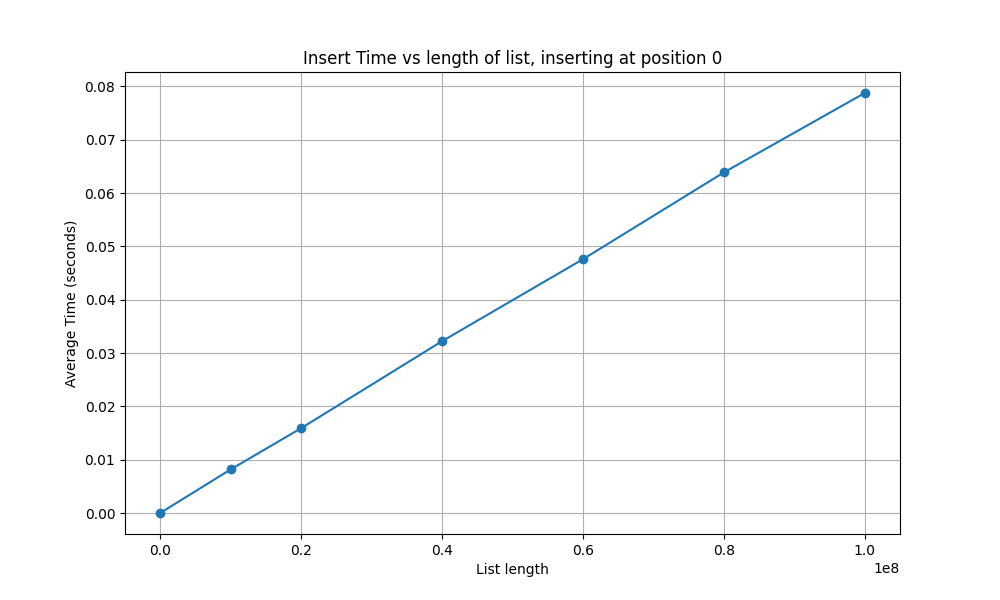

Note that for both graphs above, at each position, the time value has been average over more than 100 iterations at least. The time given is thus the average time for a single insertion

### D.3. Iteration

Iteration with a for loop is clearly of time complexity O(n). That being said, we still aim to benchmark the time and draw the graph! `;)`

The table below shows how long it takes to iterate over a list of each size using our CPU, for some chosen list sizes 

| list size | timing |
| --------- | ------- |
| 0 | 120 ns |
| 1k | 7.54 us |
| 1M | 9.56 ms |
| 10M | 95.2 ms |
| 20M | 189 ms |
| 40M | 376 ms |
| 80M | 752 ms |
| 100M | 945 ms |


Note that for this test, we only use the `pass` keyword at each iteration rather than performing any other action.

### D.4. Access

Access takes constant time (O(1)). In practice:
- reading: 
  - 120 ns
  - independent of position of element read (and list size)
- writing:
  - 120 ns
  - independent of position to write at (and list size)

### D.5. Deletion

deleting elements using `del lst[pos]` from a list of 100M elements, we get the following table and graph:

| deletion position | timing |
| ----------------- | ------ |
| 0   | 75.0 ms |
| 10M | 66.6 ms |
| 20M | 60.2 ms |
| 40M | 45.2 ms |
| 60M | 29.9 ms |
| 80M | 14.9 ms |
| 100M - 1 | 0.15 ms | 

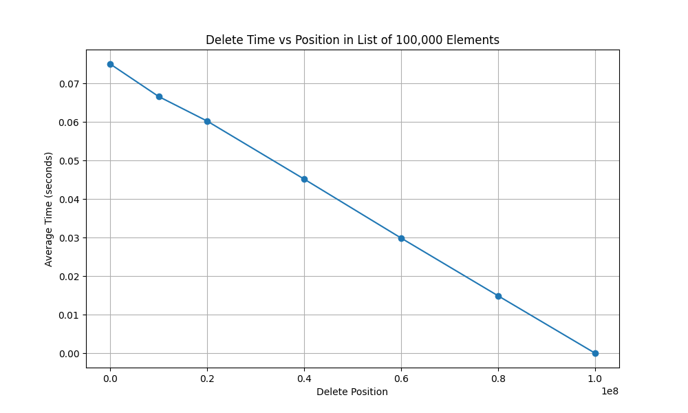

### D.6. Slicing

Slicing a list of 100M elements with different number of elements sliced (slice size), at a constant position, we get:

| Slice Size | Time |
| ----- | ----- |
| 100 | 630 ns |
| 10k | 26.6 us |
| 1M  | 4.58 ms |
| 10M | 45.0 ms |
| 20M | 89.6 ms |
| 40M | 179 ms |
| 80M | 358 ms |
| 100M | 470 ms |


Slicing a list of 100M elements with a constant slice size of 1M elements, at different positions, we get:

| Slice Beginning Position | Time |
| ------------------------ | ---- |
| 0 | 4.56 ms|
| 10M | 4.53 ms |
| 20M | 4.55 ms |
| 30M | 4.67 ms | 
| 40M | 4.74 ms |
| 50M | 4.61 ms |
| 60M | 4.56 ms |
| 70M | 4.71 ms |
| 80M | 4.73 ms |
| 90M | 4.55 ms |

This shows through experimentation that:
- slice time depends on the size of the slice
- slice time is independent of the position at which the slicing starts

 

### D.7. Searching

> ***Searching for the Presence of an element***

This is achieved with the 'in' keyword. It does not inform of the position. 

For a list of 100M elements, searching for the element that we know is at a specific position, we get the corresponding average times below:

| Searched Element's Position | Time |
| --------------------------- | ---- |
| 100 | 1.27 us |
| 10k | 105 us |
| 1M  | 11.9 ms |
| 100M | 1.19 s |

This shows experimentally that the computation time increases linearly with the position of the index to find

> ***Searching for the first position at which an element is present***

this is achieved by using the `list.index(element)` method. 

or a list of 100M elements, searching for the element that we know is at a specific position, we get the corresponding average times below:

| Searched Element's Position | Time |
| --------------------------- | ---- |
| 100 | 1.35 us |
| 10k | 113 us |
| 1M  | 12.4 ms |
| 100M | 1.21 s |

Here too, the computation time increases linearly with the position of the index to find.
Moreover, just as expected, the computation time did not increase significatively compared to the prior search.

> ***Searching fo all positions at which an element is present***

- **Method 1:** 

First, we started by enumerating the list and checking each element.

The code is:
```python
@timeit(n_iter=N_ITER)
def search_element_all_positions(lst: list[int], el: int):
    return [i for i, x in enumerate(lst) if x == el]
```

We got, for any element, a time of about 5.5 seconds.
This felt very slow. Thus we though of a second method based on the search for the first position

- **Method 2:**

We can use the algorithm that searches for the first position where the element is present.
After this position is found, we can start the search from the index after it, till we reach the end of the list.

This sacrifices a bit of the pythonic feel and readability in an effort to optimize performance.

The code is:
```python
@timeit(n_iter=N_ITER)
def search_element_all_positions_v2(lst: list[int], el: int):
    indices = []
    start = 0
    while True:
        try:
            idx = lst.index(el, start)
            indices.append(idx)
            start = idx + 1
        except ValueError:
            break
    return indices
```

Now we get, for any element, a time of about 1.2 seconds.
This is about 4 or 5 times faster than the more pythonic version above.
We can attribute that to the fact that the list.index() method is implemented in C++ which is faster.


### D.8. Sorting 

the sorted() function in python has a time complexity of O(n*log(n)) typically. [link](https://coderivers.org/blog/python-sorted-time-complexity/)

Trying to sort lists of floats of different sizes, we get the following results:
- the table will only contain a few of the results for brevity
- the graph will be made using all points acquired (50 points)
- the results have been calculated over 1k iteration each

| List Size | Sort Time |
| ----- | ------ |
| 10k  |   2.89 ms |
| 30k  |   9.51 ms |
| 50k  |   14.9 ms |
| 80k  |   24.5 ms |
| 100k |   35.3 ms |

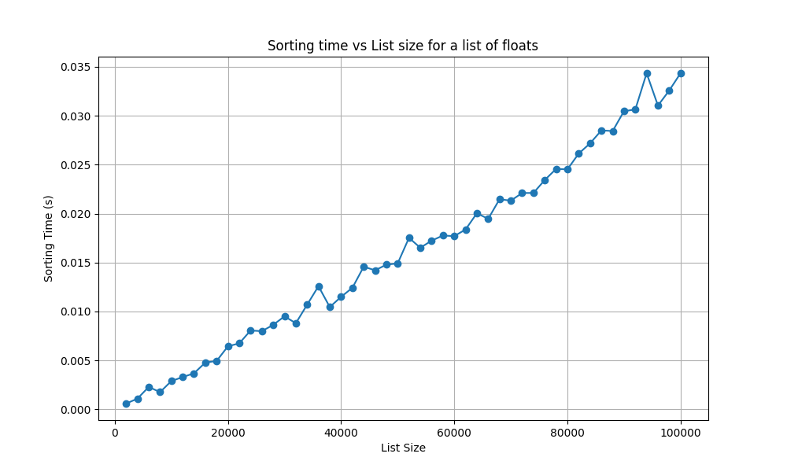

Measured over a list of 10M floats for 100 iterations, sorting took 3.71 s

## E. Arrays 

### E.1. Creation

> ***E.1.a. Creating an array of 0s***

Here, we test array creation in python and benchmark the time it takes. We average over 100 iterations.

| created array size | timing |
| --------- | ------- |
| 0 | 310 ns |
| 1k | 23.1 us |
| 1M | 26.7 ms |
| 10M | 280 ms |
| 20M | 563 ms |
| 40M | 1.1 s |
| 80M | 2.23 s |
| 100M | 2.76 s |

The associated graph is linear as shown below:

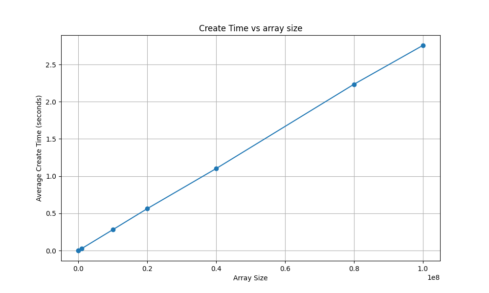


So this does go hand in hand with the fact that creating an array in python has a time complexity of O(n)

> ***E.1.b. Creating an array from a range of integers***

| created array size | timing |
| --------- | ------- |
| 0 | 670 ns |
| 1k | 111 us |
| 1M | 70.8 ms |
| 10M | 722 ms |
| 20M | 1.46 s |
| 40M | 2.89 s |
| 80M | 6.03 s |
| 100M | 7.54 s |

This shows that creating arrays from range() is around 3 times slower than creating a array of zeros. 

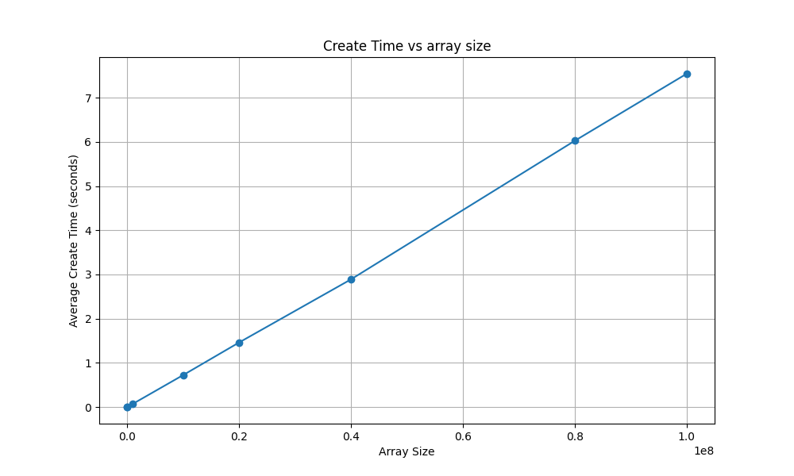

> ***E.1.c. Creating an array using list comprehensions***

| created array size | timing |
| --------- | ------- |
| 0 | 1.54 us |
| 1k | 113 us |
| 1M | 88.5 ms |
| 10M | 887 ms |
| 20M | 1.62 s |
| 40M | 3.26 s |
| 80M | 6.84 s |
| 100M | 8.09 s |

The numbers seem to suggest that creating an array using list comprehensions is only a bit slower (like around 10% to 15%) than through an iterable like range() and 3 to 4 times slower than creating an array of zeros.

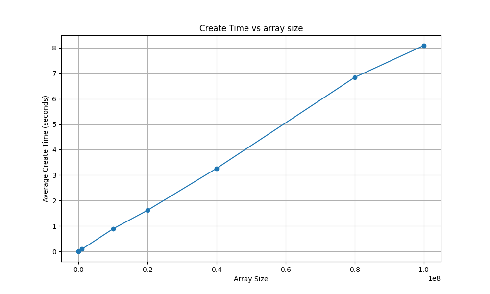

> ***E.1.d creating an array of random numbers***

| created array size | timing |
| --------- | ------- |
| 0 | 1.50 us |
| 1k | 413 us |
| 1M | 296 ms |
| 10M | 3.02 s |
| 20M | 6.33 s |
| 40M | 12.2 s |
| 80M | 22.7 s |
| 100M | 27.8 s |

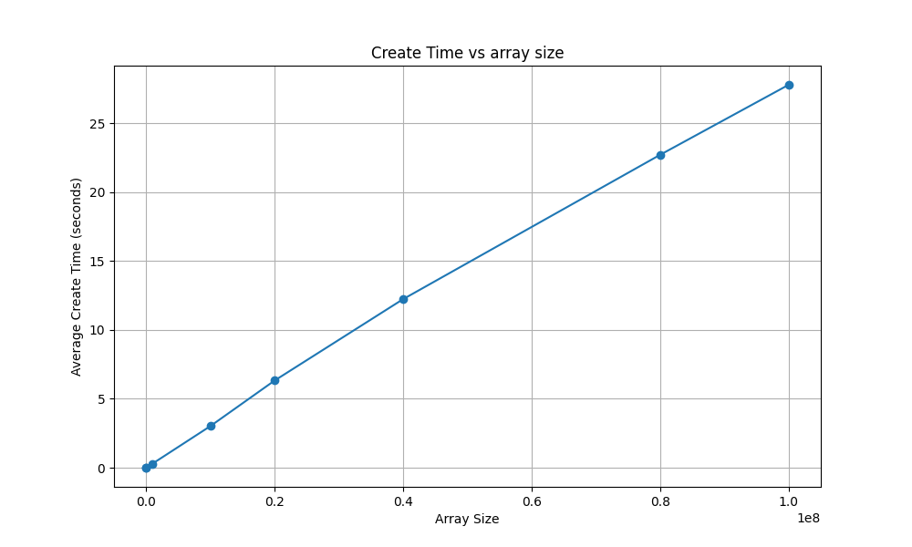

We can thus see when when trying to create a array of random floats, this is about:
- 3 times slower than creating a array with list comprehensions
- 3 to 4 times slower than creating a array from an iterable
- 9 times slower than creating a array of zeros


### E.2. Insertion

> ***coming soon***

### E.3. Iteration

The table below shows how long it takes to iterate over an array of each size using our CPU, for some chosen array sizes 

| array size | timing |
| --------- | ------- |
| 0 | 140 ns |
| 1k | 9.25 us |
| 1M | 12.2 ms |
| 10M | 124 ms |
| 20M | 246 ms |
| 40M | 488 ms |
| 80M | 979 ms |
| 100M | 1.25 s |

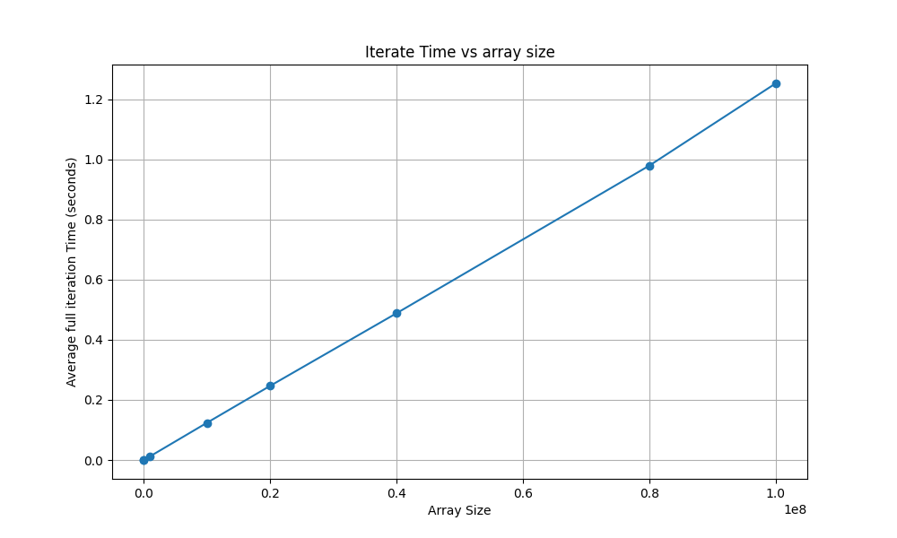

Note that for this test, we only use the `pass` keyword at each iteration rather than performing any other action.


### E.4. Access

> ***coming soon***

### E.5. Deletion


deleting elements using `del arr[pos]` from an array of 100M elements, we get the following table and graph:

| deletion position | timing |
| ----------------- | ------ |
| 0   | 55.3 ms |
| 10M | 47.5 ms |
| 20M | 41.7 ms |
| 40M | 30.2 ms |
| 60M | 20.2 ms |
| 80M | 10.4 ms |
| 100M - 1 | 141 ns | 


### E.6. Slicing


Slicing an array of 100M elements with different number of elements sliced (slice size), at a constant position, we get:

| Slice Size | Time |
| ----- | ----- |
| 100 | 330 ns |
| 10k | 1.79 us |
| 1M  | 1.11 ms |
| 10M | 12.4 ms |
| 20M | 23.5 ms |
| 40M | 50.0 ms |
| 80M | 113 ms |
| 100M | 133 ms |

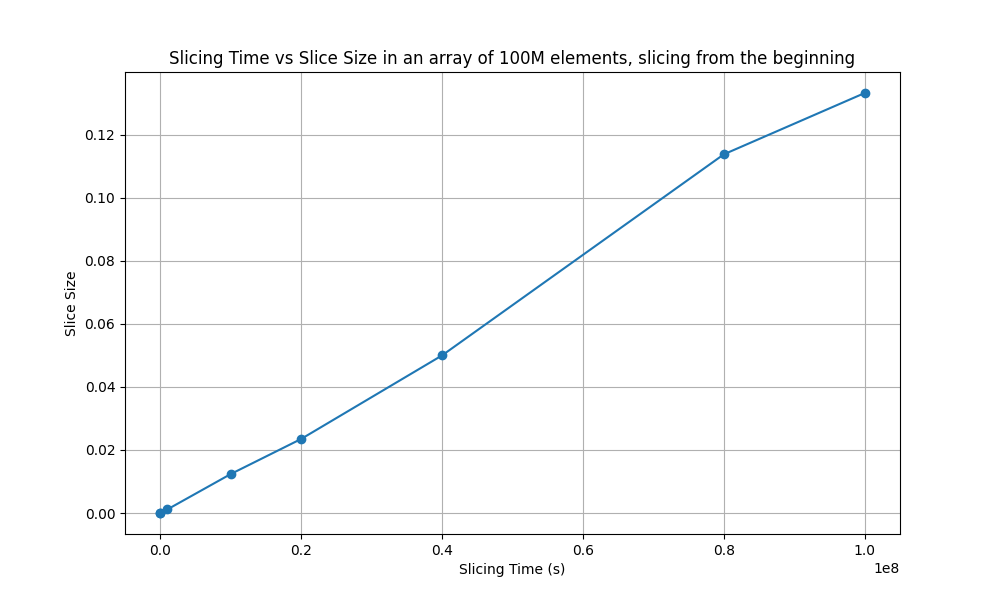

Slicing an array of 100M elements with a constant slice size of 1M elements, at different positions, we get:

| Slice Beginning Position | Time |
| ------------------------ | ---- |
| 0 | 2.08 ms|
| 10M | 1.79 ms |
| 20M | 1.54 ms |
| 30M | 1.48 ms | 
| 40M | 1.46 ms |
| 50M | 1.15 ms |
| 60M | 1.12 ms |
| 70M | 1.23 ms |
| 80M | 1.21 ms |
| 90M | 1.11 ms |

This shows through experimentation that:
- slice time depends on the size of the slice
- slice time is independent of the position at which the slicing starts

 

### E.7. Searching

For an array from the array module:

in a numpy array of 100M elements:

| Method | position of searched element| Execution Time |
| ------ | --------------- | -------------- |
| searching for the presence of an element | 100 | 1.28 us|
|  | 10k | 202 us|
|  | 1M | 21.7 ms|
|  | 100M | 2.24 s|
| searching for the position of an element| 100 | 1.36 us|
| | 10k | 218 us|
| | 1M | 24.2 ms|
| | 100M | 2.28 s|
| searching for all positions of an element| 100 | 6.45 s|
| | 10k | 6.26 s|
| | 1M | 6.18 s|
| | 100M | 6.23 s|

### E.8. Sorting 


Arrays from the array module can also be sorted through the sorted() function in python. 

Trying to sort arrays of floats of different sizes, we get the following results:
- the table will only contain a few of the results for brevity
- the graph will be made using all points acquired (50 points)
- the results have been calculated over 1k iteration each

| Array Size | Sort Time |
| ----- | ------ |
| 10k  |   1.28 ms |
| 30k  |   4.54 ms |
| 50k  |   7.80 ms |
| 80k  |   13.7 ms |
| 100k |   17.7 ms |


Measured over a array of 10M floats for 100 iterations, sorting took 3.95 s. This is a bit slower than the time taken to sort a list of this same size. It's surprising because for smaller arrays, the time to sort them compared to comparable lists was twice as fast. It probably suggests that the array's memory storage works to its advantage for performance with smaller sizes, but when the size gets too big, that advantage disappears or becomes negligeable, equalizing performance between lists and arrays. A comparative graph of when this shift starts to happen could be a nice addition

## F. Numpy Arrays

### F.1. Creation

> ***F.1.a. Creating a numpy array of zeros***

| created numpy array size | timing |
| --------- | ------- |
| 0 | 460 ns |
| 1k | 810 ns |
| 1M | 18.28 us |
| 10M | 18.31 us |
| 20M | 18.7 us |
| 40M | 26.8 us |
| 80M | 21.8 us |
| 100M | 30.5 us |

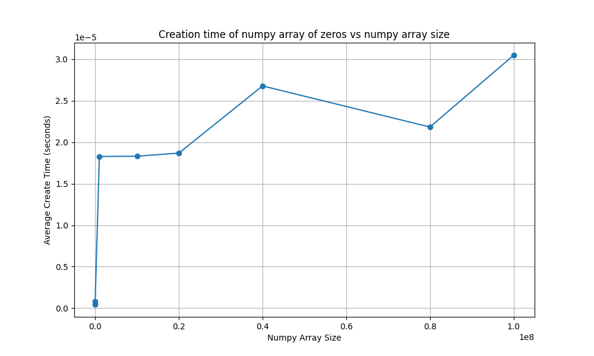

Creating a numpy array of zeros is extremely fast, even as the numpy array scales in size.

> ***F.1.b. Creating a numpy array of a range of integers***

| created numpy array size | timing |
| --------- | ------- |
| 0 | 1.56 us |
| 1k | 2.38 us |
| 1M | 1.47 ms |
| 10M | 11.2 ms |
| 20M | 22.3 ms |
| 40M | 44.7 ms |
| 80M | 92.8 ms |
| 100M | 118 ms |

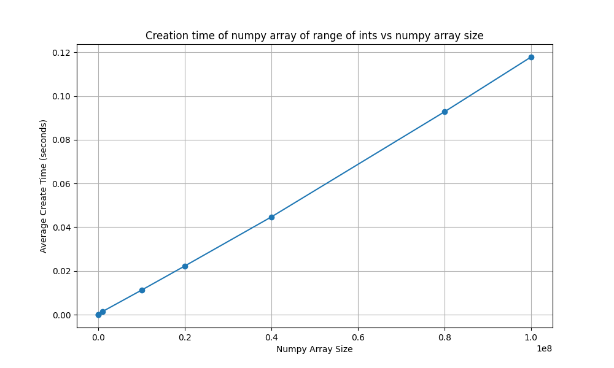

Creating a numpy array of a range of integers is far slower than creating a numpy array of zeros (in some cases 3000 times slower depending on the size of the created array)

> ***F.1.c. Creating a numpy array of random floats***

| created numpy array size | timing |
| --------- | ------- |
| 0 | 2.39 us |
| 1k | 9.94 us |
| 1M | 10.8 ms |
| 10M | 107 ms |
| 20M | 212 ms |
| 40M | 446 ms |
| 80M | 936 ms |
| 100M | 1.16 s |


Creating a numpy array of random floats is about 10 times slower than creating a numpy array of a range of integers.

### F.2. Insertion

### F.3. Iteration


The table below shows how long it takes to iterate over a numpy array of each size using our CPU, for some chosen numpy array sizes 

| numpy array size | timing |
| --------- | ------- |
| 0 | 670 ns |
| 1k | 35.1 us |
| 1M | 38.7 ms |
| 10M | 378 ms |
| 20M | 754 ms |
| 40M | 1.53 s |
| 80M | 3.17 s |
| 100M | 4.00 s |

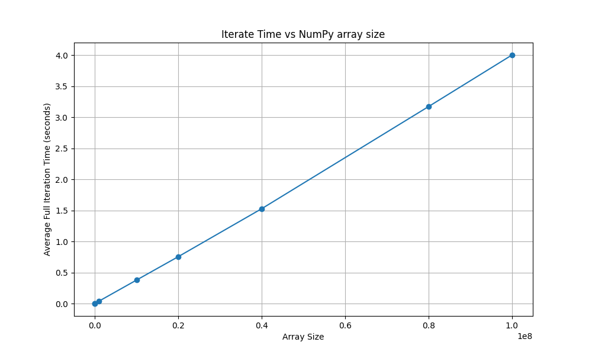

Note that for this test, we only use the `pass` keyword at each iteration rather than performing any other action.

### F.4. Access

Accessing a numpy array takes constant time (O(1)). In practice:
- reading: 
  - 190 ns
  - independent of position of element read (and list size)
- writing:
  - 190 ns
  - independent of position to write at (and list size)

### F.5. Deletion

deleting elements from a numpy array of 100M elements, we get the following table and graph:

| deletion position | timing |
| ----------------- | ------ |
| 0   | 130 ms |
| 10M | 139 ms |
| 20M | 140 ms |
| 40M | 140 ms |
| 60M | 134 ms |
| 80M | 143 ms |
| 100M - 1 | 141 ns | 


### F.6. Slicing

No matter the size or the position of the slice, we get around 500 ns of computation time.

This shows through experimentation that for numpy arrays:
- slice time is independent of the size of the slice
- slice time is independent of the position at which the slicing starts


### F.7. Searching

in a numpy array of 100M elements:

| Method | position of searched element| Execution Time |
| ------ | --------------- | -------------- |
| searching for the presence of an element | 100 | 94.0 ms|
|  | 10k | 87.5 ms|
|  | 1M | 87.5 ms|
|  | 100M | 87.7 ms |
| searching for the position of an element| 100 | 90.1 ms|
| | 10k | 87.6 ms|
| | 1M | 87.2 ms|
| | 100M | 98.4 ms|
| searching for all positions of an element| 100 | 87.0 ms|
| | 10k | 87.3 ms|
| | 1M | 89.4 ms|
| | 100M | 99.3 ms|

As noticed, the search is independent from the actual position of the searched element,as well as from the search's goal (presence vs position vs all positions). In all the cases above, the entire numpy array is being scanned through, so the time complexity depends on the size of the array rather than the position of the searched-for element. 


### F.8. Sorting 

Sorting an array of 10M floats in numpy takes around 180ms thanks to np.sort() 

This is around 20 times faster than sorting lists which took 3.71 s

## G. Numpy Arrays with Numba

### G.1. Creation


> ***G.1.a. Creating a numpy array of zeros with numba***

| created numpy array size | timing |
| --------- | ------- |
| 0 | 2.11 us |
| 1k | 1.27 us |
| 1M | 2.17 ms |
| 10M | 21.5 ms |
| 20M | 45.3 ms |
| 40M | 91.6 ms |
| 100M | 243 ms |


Creating a numpy array of zeros with numba is far slower than creating one without numba due to the already optimized C++ code underneath the numpy methods.

> ***G.1.b. Creating a numpy array of a range of integers with numba***

| created numpy array size | timing |
| --------- | ------- |
| 0 | 1.86 us |
| 1k | 3.46 us |
| 1M | 2.35 ms |
| 10M | 23.7 ms |
| 20M | 47.2 ms |
| 40M | 96.4 ms |
| 100M |243 ms |

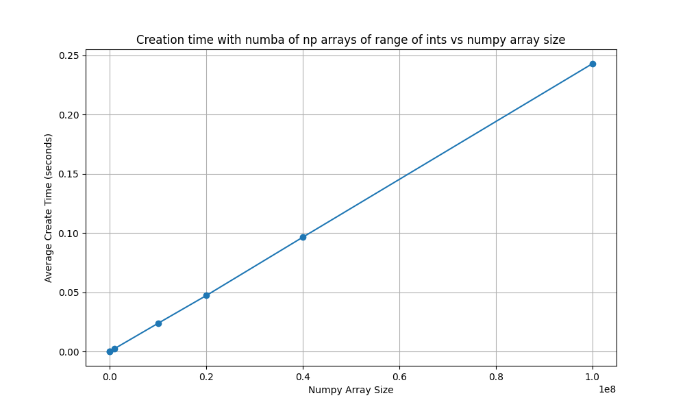

Creating a numpy array of a range of integers with numba is around twice slower than creating it without numba. Comparing G.1.a to G.1.b, we notice that both take around the same time because it's really the cost of the numba optimized for loop + basic the same basic methods.

> ***G.1.c. Creating a numpy array of random floats with numba***

| created numpy array size | timing |
| --------- | ------- |
| 0 | 1.42 us |
| 1k | 15.6 us |
| 1M | 7.55 ms |
| 10M | 78.8 ms |
| 20M | 153 ms |
| 40M | 305 ms |
| 100M | 759 ms |

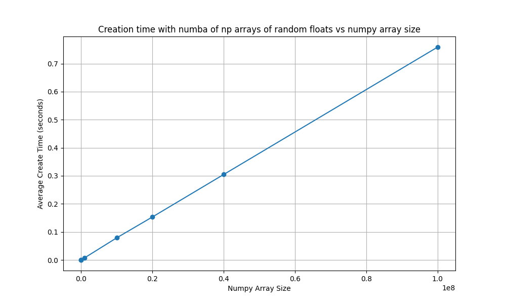

Creating a numpy array of random floats with numba is about 60 to 70% faster than creating it without numba.


### G.2. Insertion

> ***coming soon***

### G.3. Iteration

The table below shows how long it takes to iterate over a numpy (with numba) array of each size using our CPU, for some chosen numpy array sizes 

| numpy array size | timing |
| --------- | ------- |
| 0 | 260 ns |
| 1k | 250 ns |
| 1M | 270 ns |
| 10M | 250 ns |
| 20M | 270 ns |
| 40M | 240 ns |
| 80M | 250 ns |
| 100M | 260 ns |

We see that the iterating over the list with numba is constant time (which probably suggests the iteration itself has been optimized out thanks to njit).

Note that for this test, we only use the `pass` keyword at each iteration rather than performing any other action.

### G.4. Access

Accessing a numpy array when paired with numba turns out to be around 50% slower.
This is probably because @njit compiles python code to machine language.
Each time the compiled code is called, it will involve a boundary crossing.
This overhead is unnecessary for such small and easy operations like accessing arrays

Time Complexity remains O(1) and we have:
- reading: 
  - 300 ns
  - independent of position of element read (and list size)
- writing:
  - 300 ns
  - independent of position to write at (and list size)

### G.5. Deletion

deleting elements using  from an array (with numba) of 100M elements, we get the following table and graph:

| deletion position | timing |
| ----------------- | ------ |
| 0   | 183 ms |
| 10M | 177 ms |
| 20M | 178 ms |
| 40M | 162 ms |
| 60M | 152 ms |
| 80M | 154 ms |
| 100M - 1 | 177 ns | 


### G.6. Slicing

When attempting slicing with numba, it seems that using just numpy is superior. Iterating with numba is gonna be linear speed compared to the array slicing in numpy which is constant speed. This is far slower and can take milliseconds compared to nanoseconds with numba.

On the other hand, if we wrap numba with njit and call it a day, we get constant time complexity but the result is about 1 us to 3 us, which is 2 to 6 times slower than using just numpy.

### G.7. Searching

in a numpy array of 100M elements, using numba to achieve our results:

| Method | position of searched element| Execution Time |
| ------ | --------------- | -------------- |
| searching for the presence of an element | 100 | 420 ns|
|  | 10k | 4.50 us|
|  | 1M | 422 us|
|  | 100M | 54.7 ms |
| searching for the position of an element| 100 | 460 ns|
| | 10k | 4.81 us|
| | 1M | 510 us|
| | 100M | 54.9 ms|
| searching for all positions of an element| 100 |52.9 ms|
| | 10k | 53.5 ms|
| | 1M | 53.0 ms|
| | 100M | 53.1 ms|

Above, we notice that:
- with numba, using the 'in' keyword to search for the presence of the element in the numpy array is slower than looping over the range of elements and checking each.
- since we are using `for` loops, time complexity is O(i) with i the number of iterations made
  - for presence search and first index search, this means the position affect the computation time
  - for all index search, we have to search the entire numpy array, which results in O(n) where n is the numpy array's size

### G.8. Sorting 

It seems that for now, sorting numpy arrays with numba is slower than doing it just in numpy, this is also mentionned in the [numba docs](https://numba.readthedocs.io/en/stable/reference/numpysupported.html) as such:


Experimentally, we find that sorting an array of 10M floats with numba takes 1.2 s compared to numpy's 180 ms, making this a slow-down of 6 to 7 times.